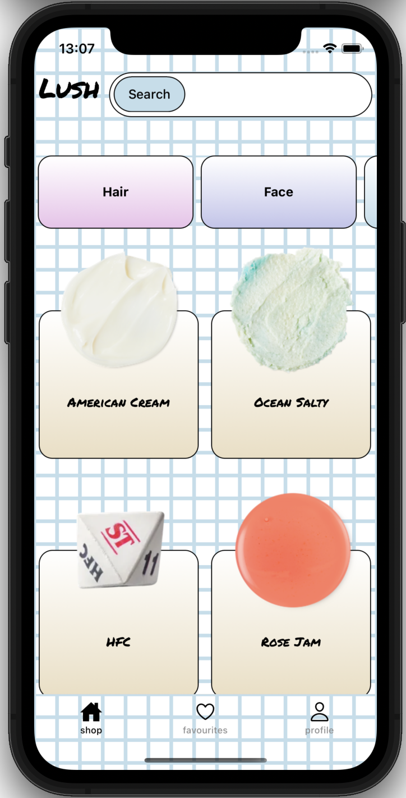
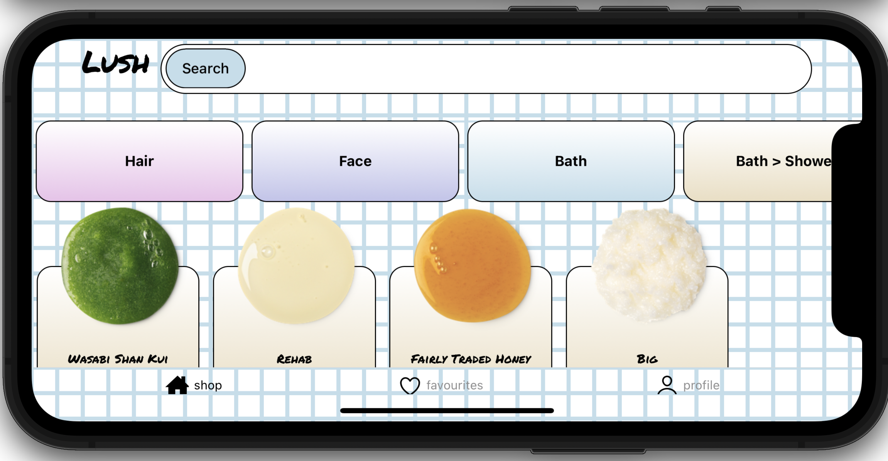

# Hey

This is an [Expo](https://expo.dev) project created with [`create-expo-app`](https://www.npmjs.com/package/create-expo-app).

## Get started

1. Install dependencies

   ```bash
   npm install
   ```

2. Start the app

   ```bash
   npx expo start
   ```


## Assumptions

I've assumed isAvailable being false means sold out. 

## Things to note

Instead of local state i have used zustand which allows the app to create fake profiles. You'll need to remember the name you entered on the login screen in order to see any favourites you have saved or how many items you have of a product in your basket. Logging in with a different name will create a new profile.






